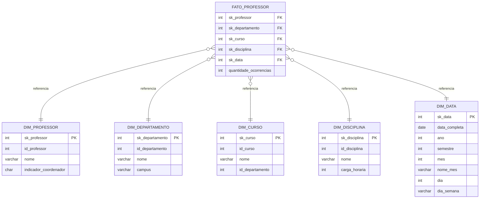

# CriandoumStarSchemaparaCen-riosdeVendas-
Descrição do Desafio - Criando um Star Schema para Cenários de Vendas-DIO

## Objetivo

Criar o diagrama dimensional (star schema) com base no diagrama relacional fornecido, refletindo dados sobre professor, disciplinas ministradas e departamento. Dados de aluno ficam fora do escopo.

## Modelo relacional de origem

Imagem original em [`docs/diagrama_relacional_original.png`](docs/diagrama_relacional_original.png).

Entidades identificadas (extraídas via OCR da imagem — campos marcados como incertos precisam ser confirmados visualmente no diagrama):

| Tabela | Campos identificados |
|---|---|
| Departamento | idDepartamento (PK), Nome, Campus, idProfessor_coordenador (FK → Professor) |
| Professor | idProfessor (PK), Departamento_idDepartamento (FK) |
| Curso | idCurso (PK), Departamento_idDepartamento (FK) [nome do curso: **CONFIRMAR NO DIAGRAMA**] |
| Disciplina | idDisciplina (PK), Professor_idProfessor (FK), Curso_idCurso (FK) [nome/carga horária: ] |
| Aluno | idAluno (PK) — fora do escopo deste desafio |
| Matriculado | Aluno_idAluno (FK), Disciplina_idDisciplina (FK) — fora do escopo |
| Pré-requisitos | relaciona Disciplina consigo mesma (pré-requisito entre disciplinas) — fora do escopo |

## Modelo dimensional proposto

**Grão da fato:** uma ocorrência de (Professor × Disciplina × Curso × Departamento × Data). Modelo do tipo *factless fact table* — não havia métrica numérica explícita no modelo de origem, então a fato conta ocorrências.



### Dimensões

- **Dim_Professor** — chave natural `id_professor`; `indicador_coordenador` derivado do relacionamento `idProfessor_coordenador` em Departamento (S/N) 
- **Dim_Departamento** — Nome e Campus vindos diretamente do relacional
- **Dim_Curso** — desnormaliza `id_departamento` para permitir drill-down direto sem passar por outra dimensão
- **Dim_Disciplina** — carga horária incluída como sugestão de atributo analítico — **[CONFIRMAR SE EXISTE NA ORIGEM]**
- **Dim_Data** — granularidade diária sugerida (o desafio deixa a granularidade em aberto); pode ser trocada para mês/semestre conforme a necessidade de análise 

### Fato

- **Fato_Professor** — uma linha por combinação Professor/Disciplina/Curso/Departamento/Data, com contador de ocorrências como métrica base.

## Estrutura sugerida do repositório

```
/
├── README.md
├── schema.sql                          → DDL das dimensões e da fato
├── docs/
│   └── diagrama_relacional_original.png
└── diagrama_estrela.mmd                → diagrama em Mermaid (mesmo do README)
```

## Pontos a confirmar antes de considerar o desafio fechado

- [ ] Nome real da coluna/atributo em Curso e Disciplina (não veio legível no OCR)
- [ ] Existência de carga horária ou outra métrica numérica no modelo de origem
- [ ] Regra exata de derivação do indicador de coordenador em Dim_Professor
- [ ] Granularidade final da Dim_Data (dia, mês ou semestre)
- [ ] Se houver repositório do expert da DIO para este desafio, adicionar link e considerar fork
